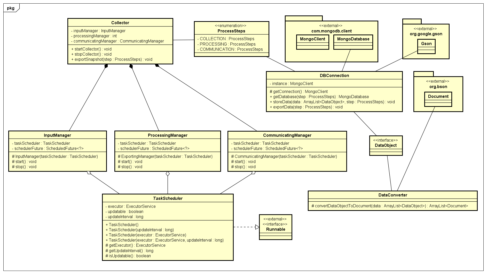

# COLLECTOR Framework - INF2102

Inspired by how data mining processes in software repositories are structured, the COLLECTOR framework aims to facilitate data mining processes composed of three main steps: input (or data collection), processing and communication (or exporting), in this respective order. This help is through abstractions that facilitate paralellism and data management that respects the different steps of the process, making the process more traceable, and therefore replicable.

The framework also allows for continuous data collection, which is useful in cases where the raw data source is constantly updated, as it frequently happens when working with software repositories. Its extensible arquitecture allow for the creation of very diverse applications (e.g. bots that monitor changes in software quality metrics and/or how code smells are afected by a change in GitHub pull requests, applications for the continuous generation of datasets, etc). Nevertheless, a sample program that instantiates the framework will also be developed as part of this project.

# User Documentation

## Building

The implementation uses gradle as a dependency manager. In case you don't have a local installation of gradle, all gradle commands in the following lines can be replaced by the usage of `gradlew <command>`. The gradlew executable is present in this repository.

To download the dependencies and build the .class files, run the `gradle build` command on the root of the repository (same folder as the build.gradle file).

After the execution of the previous command, the command `gradle distZip` can generate a binary distribution compressed in a .zip file. The execution of this distribution is covered in the Execution subsection.

## Testing

After the project is built using `gradle build` (covered in the previous section), you can use the `gradle test` command to execute the automated tests.

## Executing

After the project is built using `gradle build` (covered in the first section), you can use the `gradle run` command to execute the automated tests. An already compiled release can also be found in the [releases page for the repository](https://github.com/danieljbc/collector/releases).

## IntelliJ IDEA

This project supports the usage of IntelliJ IDEA to automate the setup and execution of the aforementioned gradle steps. 

To use this, just import the project folder with the IDE.

# Requirements

* [Requirements Document](./docs/REQUIREMENTS.md)

# Test Guide and Logs

* [Test Guide and Logs](./docs/TESTS.md)

# Architectural Design

The framework was designed modularly, so that the actions performed in each of the steps (collection, processing and communication) is defined by the framework's frozen spots.  While the framework is designed to support empirical studies, this design allows the framework to be used for other types of tasks.

An overview of the arquitecture can be seen in the following image:

The framework is composed of a central module (implementing the Facade pattern) that is responsible for communication with three other classes: InputManager, ProcessingManager and CommunicationManager, that each represent a different step of the process. The actions that will be executed by these managers is defined through concrete implementations for the abstract class TaskScheduler (provided by the developer that is using the framework).

The TaskScheduler (using the Command pattern), allows the user to either, execute a set of sequential data collection tasks or schedule tasks to be executed asynchronously (using the bag of tasks pattern and using the implementation provided by the Java thread pool API). The actions can also be configured to be executed periodically, to allow for continuous extraction processes.

All modules are supported and make use of the helper class DBConnection, that manages integration with the MongoDB database that is used to store the data that is being extracted and processed. This class is also responsible for converting java objects into JSON documents that can be inserted in the database. This is done through the DataConverter class, that uses the external library gson to perform this task.

Details about the instantiation of the framework that was also developed can be found in [Test Guide and Logs](./docs/TESTS.md).

## Class Diagram - Framework

## Use Case Diagram - Framework

## Class Diagram - Instantiation

